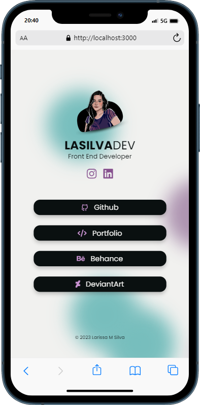
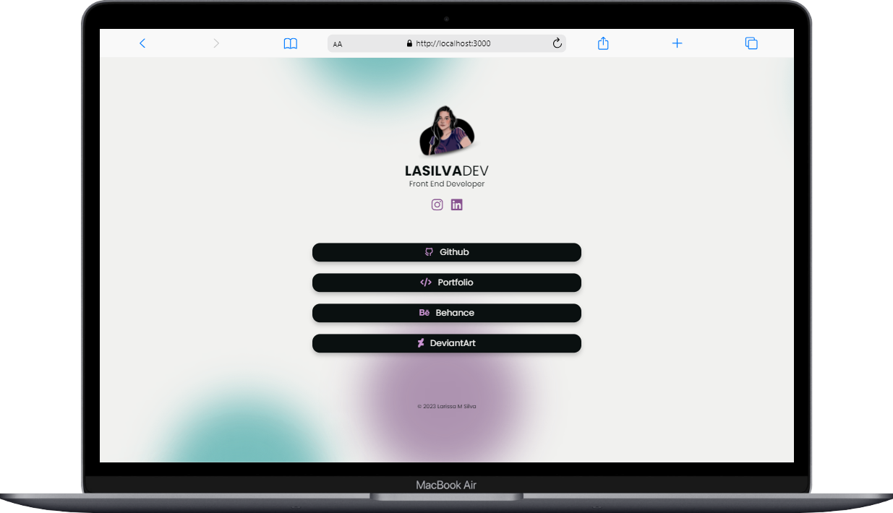

# LASILVADEV LINKS 🔗
Deploy de primeiro projeto desenvolvido em React.js.

Uma página web criada como alternativa aos sites de links. Desenvolvida para disponibilizar meus principais links, de forma customizável e gratuita.
 
## ÍNDICE
- <a href="#tecnologias-utilizadas">Tecnologias Utilizadas</a>
- <a href="#demo">Demo</a>
- <a href="#autora">Autora</a>

## TECNOLOGIAS UTILIZADAS
Esse projeto foi desenvolvido com as seguintes tecnologias:
- [React](https://react.dev/)
  - JSX
  - CSS
  - JavaScript
    
## DEMO

 

[Clique aqui ou na imagem para ver a página.](https://lasilvadev.github.io/links/)

## AUTORA

Larissa M. Silva

[LinkedIn](https://www.linkedin.com/in/mslarissasilva/)  |  [Instagram](https://www.instagram.com/lasilvadev/)  |  [Portfolio Site](https://portfoliolarissa.netlify.app/)
